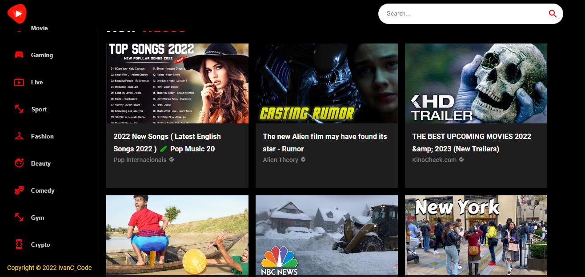

# youtube-clone

## Project image

        

## Build
- [React JS](https://pt-br.reactjs.org/)
- [Rapid API](https://rapidapi.com/hub)
- [Material UI 5](https://mui.com/pt/)

## To run the application

### installing dependencies
- [npm](https://www.npmjs.com/)
* $ npm install
### run project
* $ npm start

